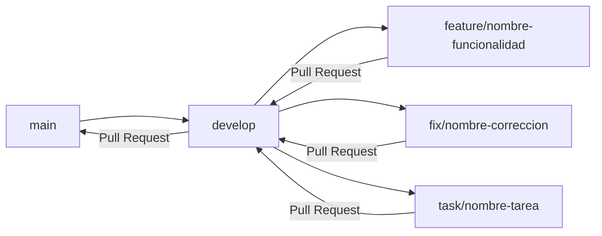
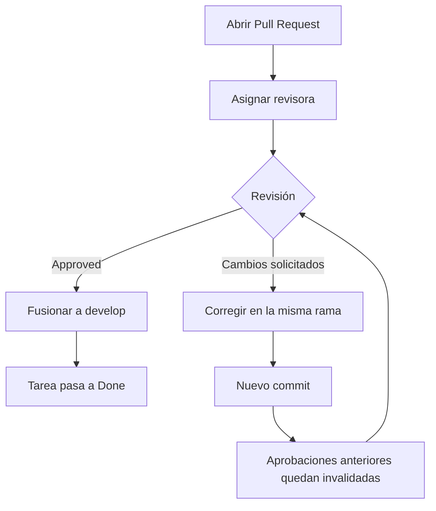

# Contribuir a VINTRA

Guía de flujo de trabajo para el equipo del proyecto. Aplica a todas las célu­las (UI/UX, Base de Datos, Backend/Frontend, Scrum, GitHub/CI-CD/VPS).

## Tabla de contenido

- [Antes de empezar](#antes-de-empezar)
- [Estrategia de ramas](#estrategia-de-ramas)
- [Flujo de trabajo](#flujo-de-trabajo)
- [Convención de mensajes de commit](#convención-de-mensajes-de-commit)
- [Pull Requests](#pull-requests)
- [Revisión y aprobación](#revisión-y-aprobación)

## Antes de empezar

```
git clone https://github.com/Univalle-P-I/VINTRA.git
cd VINTRA
git config user.email "tu-correo@ejemplo.com"
git config user.name "Tu Nombre"
```

Usa el mismo correo con el que tienes tu cuenta de GitHub, para que tus commits queden asociados a tu usuario.

## Estrategia de ramas



- **`main`** — versión estable del proyecto.
- **`develop`** — integración de todo el trabajo en curso.
- **`feature/`** — funcionalidades nuevas.
- **`fix/`** — corrección de errores.
- **`task/`** — tareas que no son ni funcionalidad ni corrección (documentación, configuración, dependencias, etc.).
Toda rama de trabajo se crea a partir de `develop`, nunca a partir de `main`.

## Flujo de trabajo

```
git checkout develop
git pull origin develop
git checkout -b feature/nombre-de-tu-tarea
```

Trabaja normalmente y guarda avances con commits pequeños y descriptivos:

```
git add .
git commit -m "Tipo: descripción breve del cambio"
```

Sube la rama la primera vez con:

```
git push -u origin feature/nombre-de-tu-tarea
```

Las siguientes veces basta con:

```
git push
```

## Convención de mensajes de commit

| Prefijo | Uso |
| --- | --- |
| `feat:` | Nueva funcionalidad |
| `fix:` | Corrección de un error |
| `docs:` | Cambios de documentación (README, ARCHITECTURE, etc.) |
| `style:` | Cambios de formato que no afectan la lógica |
| `refactor:` | Cambios internos sin alterar el comportamiento |
| `test:` | Pruebas |
| `chore:` | Tareas de mantenimiento, configuración, dependencias |

Ejemplo: `git commit -m "docs: actualiza README con estructura del proyecto"`

## Pull Requests

Toda rama de trabajo se integra a `develop` mediante Pull Request, nunca con push directo. El PR debe incluir:

- **Qué cambió** — resumen del cambio.
- **Descripción breve** — contexto o motivo del cambio.
- **Cómo se validó** — qué se revisó o probó.
- **Comandos utilizados** — si aplica.
- **Imágenes de prueba** — evidencia de que el cambio funciona (captura de pantalla, resultado de una prueba, etc.). Es obligatorio, no opcional.

```
git push -u origin feature/nombre-de-tu-tarea
```

Luego abre el Pull Request desde GitHub, comparando tu rama contra `develop`.

### Requisitos adicionales del Pull Request

- Debe asignarse a una persona como revisora.
- Debe mencionar o vincularse a la tarea/issue a la que corresponde.
- Debe incluir imágenes de prueba como evidencia de que el cambio funciona.

## Revisión y aprobación



- Los Pull Requests son revisados por **Daniel Enrique** o **Estefani Cometa**.
- Se requiere al menos **1 aprobación** para fusionar hacia `develop`.
- Si se agregan nuevos commits después de una aprobación, esa aprobación deja de ser válida y se necesita una nueva revisión.
- Solo si el resultado es **Approved** la tarea puede pasar a **Done**. o se hace **mergue** a `develop`.
- Si no es aprobado, la persona sigue trabajando en la misma rama hasta corregir lo señalado y lograr el Approved.
- Mientras el Pull Request está abierto, se bloquean la **eliminación de la rama** y los **force-push**.
**Nota:** los comentarios que señalen errores, problemas de integración o cambios en contratos compartidos deben atenderse antes del merge. Las sugerencias menores pueden quedar como mejoras posteriores si el equipo lo acuerda.
