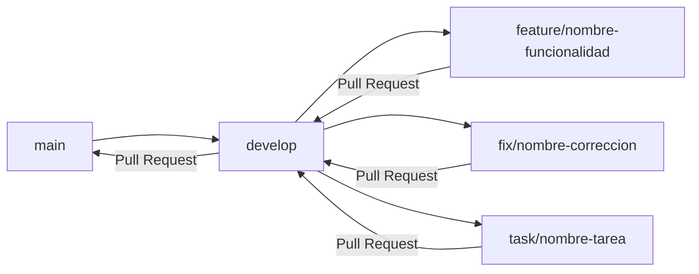
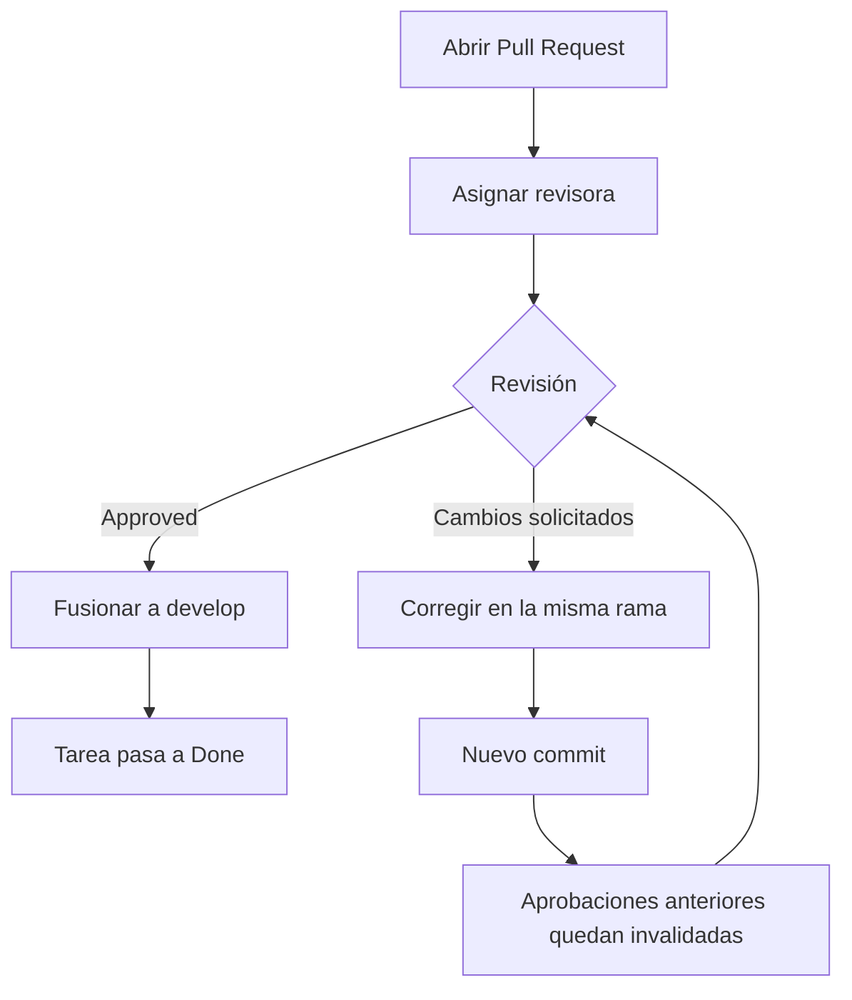

# Contribuir a VINTRA

Guía de flujo de trabajo para el equipo del proyecto. Aplica a todas las célu­las (UI/UX, Base de Datos, Backend/Frontend, Scrum, GitHub/CI-CD/VPS).

## Tabla de contenido

- [Antes de empezar](#antes-de-empezar)
- [Estrategia de ramas](#estrategia-de-ramas)
- [Flujo de trabajo](#flujo-de-trabajo)
- [Convención de mensajes de commit](#convención-de-mensajes-de-commit)
- [Pull Requests](#pull-requests)
- [Checks y cómo interpretarlos](#checks-y-cómo-interpretarlos)
- [Revisión y aprobación](#revisión-y-aprobación)

## Antes de empezar

```bash
git clone https://github.com/Univalle-P-I/VINTRA.git
cd VINTRA
git config user.email "tu-correo@ejemplo.com"
git config user.name "Tu Nombre"
```

Usa el mismo correo con el que tienes tu cuenta de GitHub, para que tus commits queden asociados a tu usuario.

## Estrategia de ramas



- **`main`** — versión estable del proyecto.
- **`develop`** — integración de todo el trabajo en curso.
- **`feature/`** — funcionalidades nuevas.
- **`fix/`** — corrección de errores.
- **`task/`** — tareas que no son ni funcionalidad ni corrección (documentación, configuración, dependencias, etc.).
Toda rama de trabajo se crea a partir de `develop`, nunca a partir de `main`.

## Flujo de trabajo

```bash
git checkout develop
git pull origin develop
git checkout -b feature/TRELLO-123-nombre-de-tu-tarea
```

Incluye en el nombre de la rama el identificador de la tarjeta de Trello asociada (por ejemplo, `TRELLO-123`). Sustituye el prefijo `feature/` por `fix/` o `task/` según corresponda.

Trabaja normalmente y guarda avances con commits pequeños y descriptivos:

```bash
git add .
git commit -m "Tipo: descripción breve del cambio"
```

Sube la rama la primera vez con:

```bash
git push -u origin feature/TRELLO-123-nombre-de-tu-tarea
```

Las siguientes veces basta con:

```bash
git push
```

## Convención de mensajes de commit

| Prefijo | Uso |
| --- | --- |
| `feat:` | Nueva funcionalidad |
| `fix:` | Corrección de un error |
| `docs:` | Cambios de documentación (README, documentación por área, arquitectura, etc.) |
| `style:` | Cambios de formato que no afectan la lógica |
| `refactor:` | Cambios internos sin alterar el comportamiento |
| `test:` | Pruebas |
| `chore:` | Tareas de mantenimiento, configuración, dependencias |

Ejemplo: `git commit -m "docs: actualiza README con estructura del proyecto"`

## Pull Requests

Toda rama de trabajo se integra a `develop` mediante Pull Request, nunca con push directo. El PR debe incluir:

- **Qué cambió** — resumen del cambio.
- **Descripción breve** — contexto o motivo del cambio.
- **Cómo se validó** — qué se revisó o probó.
- **Comandos utilizados** — si aplica.
- **Imágenes de prueba** — evidencia de que el cambio funciona (captura de pantalla, resultado de una prueba, etc.). Es obligatorio, no opcional.

```bash
git push -u origin feature/TRELLO-123-nombre-de-tu-tarea
```

Luego abre el Pull Request desde GitHub, comparando tu rama contra `develop`.

### Requisitos adicionales del Pull Request

- Debe asignarse a una persona como revisora.
- Debe indicar en su descripción el nombre o identificador de la tarjeta de Trello y enlazarla directamente. El identificador de la tarjeta también debe estar en el nombre de la rama para mantener la trazabilidad entre Trello y GitHub.
- Si la tarea también tiene un issue de GitHub, debe mencionarse o vincularse además de la tarjeta de Trello.
- Debe incluir imágenes de prueba como evidencia de que el cambio funciona.

Ejemplo para la descripción del PR: `Trello: [TRELLO-123 - Ajustar inicio de sesión](https://trello.com/c/abc123...)`.

## Checks y cómo interpretarlos

### Checks automáticos del PR

El workflow **CI** se ejecuta al abrir o actualizar un PR hacia `develop` y en cada push a `develop` o `main`. Comprueba con `git diff --check` que los cambios no introduzcan errores de espacios en blanco. El repositorio aún no contiene el código de backend o frontend ni workflows que ejecuten sus pruebas automatizadas; realiza las validaciones locales descritas abajo antes de abrir un PR.

El check **lint-markdown** también valida el formato de `README.md`, `CONTRIBUTING.md` y los archivos Markdown de `docs/`. Para ejecutarlo localmente:

```bash
npx --yes markdownlint-cli2 "README.md" "CONTRIBUTING.md" "docs/**/*.md"
```

### Validación local

Para el frontend, desde `frontend/`:

```bash
npm ci
npm test -- --watchAll=false
npm run build
```

La prueba pasa cuando Jest termina con las suites y pruebas en estado `passed`. El build pasa cuando Create React App finaliza sin errores y genera `frontend/build/`; un error de compilación o de dependencias requiere corrección. Los tests pueden informar fallos aunque el build compile correctamente: son comprobaciones distintas.

Para el backend, desde `backend/` y con las dependencias de `requirements.txt` instaladas:

```bash
python manage.py check
python manage.py test users
```

El check pasa si Django reporta que no encontró problemas; las pruebas pasan si terminan con `OK`. Un error o una prueba fallida significa que la validación no pasó y debe revisarse el mensaje concreto. Estos comandos son validaciones locales; CI aún no ejecuta las pruebas del backend.

## Revisión y aprobación



- Los Pull Requests son revisados por la persona asignada.
- Se requiere al menos **1 aprobación** para fusionar hacia `develop`.
- Si se agregan nuevos commits después de una aprobación, esa aprobación deja de ser válida y se necesita una nueva revisión.
- Solo si el resultado es **Approved** la tarea puede pasar a **Done**. o se hace **mergue** a `develop`.
- Si no es aprobado, la persona sigue trabajando en la misma rama hasta corregir lo señalado y lograr el Approved.
- Mientras el Pull Request está abierto, se bloquean la **eliminación de la rama** y los **force-push**.
**Nota:** los comentarios que señalen errores, problemas de integración o cambios en contratos compartidos deben atenderse antes del merge. Las sugerencias menores pueden quedar como mejoras posteriores si el equipo lo acuerda.

### Trazabilidad entre Trello y GitHub

Todo trabajo debe mantener una referencia clara entre la tarjeta de Trello y los cambios realizados en GitHub.

Para mantener esta trazabilidad:

- El número de la tarjeta de Trello debe incluirse en el nombre de la rama.
- El Pull Request debe incluir el número, nombre o enlace de la tarjeta de Trello correspondiente.
- La referencia a la tarjeta debe mantenerse durante todo el desarrollo de la tarea.

Ejemplo de nombre de rama:

```bash
task/12-estructura-repositorio
