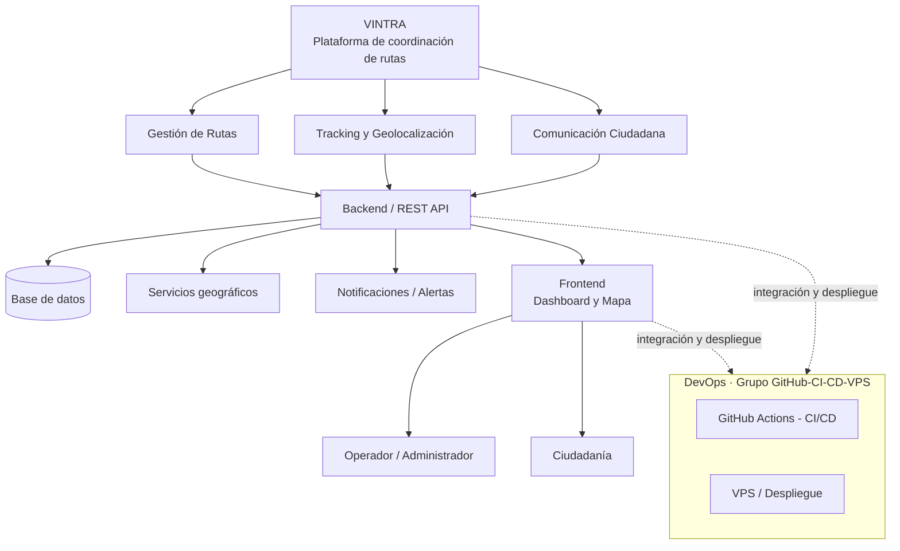
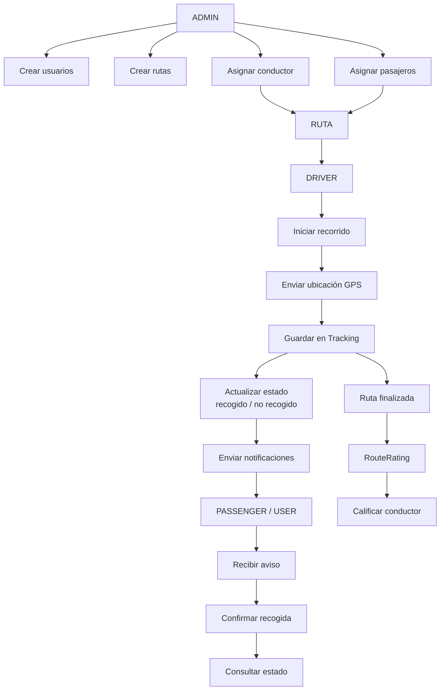

<!-- markdownlint-disable MD033 MD041 -->

<div align="center">

<h1> VINTRA </h1>

<p><strong>Sistema de coordinación y seguimiento de rutas de recolección de residuos sólidos.</strong></p>

<p>
  <a href="#estado-del-proyecto"></a>
  <a href="#">
  <a href="LICENSE"></a>
</p>

<p>
  <a href="docs/README.md">Documentación</a> ·
  <a href="docs/arquitectura/README.md">Arquitectura</a> ·
  <a href="VINTRA.pdf">Propuesta VINTRA</a> ·
  <a href="CONTRIBUTING.md">Contribuir</a>
</p>

</div>

<!-- markdownlint-enable MD033 MD041 -->

---

## ¿Qué es VINTRA?

VINTRA es una plataforma digital para la gestión, coordinación y seguimiento de rutas de recolección de residuos sólidos, que conecta la operación del servicio de aseo con la ciudadanía mediante información clara y oportuna sobre horarios, recorridos y novedades del servicio.

## Génesis del proyecto

VINTRA nace de un análisis realizado en clase sobre la problemática de la recolección de residuos sólidos en Buenaventura. Mediante un diagrama de Ishikawa, el equipo identificó y priorizó las causas del problema, encontrando que las de mayor peso eran:

- Deficiencia en la planificación y coordinación de rutas (causa con mayor puntuación).
- Falta de información en tiempo real sobre el paso del vehículo recolector.
A partir de este diagnóstico, se concluyó que el problema no es únicamente la acumulación de basuras —que es una consecuencia—, sino la falta de organización, coordinación y comunicación entre el operador del servicio de aseo y la ciudadanía. VINTRA es la respuesta tecnológica a ese diagnóstico.

## Problema que resuelve

Deficiencias en la planificación, coordinación y comunicación del servicio de recolección de residuos sólidos en Buenaventura, que generan incertidumbre en la ciudadanía sobre el paso del vehículo recolector y favorecen la acumulación de residuos en las calles.

## Propuesta de valor

VINTRA convierte un servicio operado de forma dispersa y poco visible en un sistema coordinado, trazable y comunicado:

| Para el operador | Para la ciudadanía |
| --- | --- |
| Planificación y asignación de rutas | Consulta de horarios y recorridos |
| Seguimiento en tiempo real de vehículos | Aviso de proximidad del vehículo |
| Optimización de recorridos minuciosos | mayor facilidad para dejar la basura |
| Registro de novedades e incumplimientos | Reporte de acumulación de residuos |
| Indicadores de cumplimiento del servicio | Visibilidad del estado de sus reportes |

## Objetivos

### Objetivo general

Desarrollar una plataforma web que permita gestionar, planificar y monitorear las rutas de recolección de residuos sólidos, proporcionando información operativa y geográfica que facilite la coordinación del servicio y permita a la ciudadanía reportar situaciones relacionadas con la acumulación de residuos.

### Objetivos específicos

- Centralizar la planificación y asignación de rutas y horarios de recolección.
- Ofrecer seguimiento geográfico en tiempo real de los vehículos recolectores.
- Reducir la incertidumbre ciudadana sobre el paso del servicio.
- Permitir el registro y gestión de reportes ciudadanos.
- Generar indicadores de cumplimiento para la toma de decisiones.

## Arquitectura resumida



## Roles y Accesibilidad

La plataforma se adapta a cada perfil de forma segura para garantizar flujos de trabajo claros e interactivos.

### Administrador

- Crear rutas estratégicas
- Asignar conductores a flotas
- Gestioner y auditar vehículos
- Consultar y resolver incidencias

### Conductor
- Iniciar recorrido asignado
- Registrar ubicación GPS activa
- Visualizar estado vial de rutas
- Finalizar recorrido y reportar novedades

### Ciudadano

- Consultar horario de recolección
- Consultar trayecto de ruta local
- Reportar residuos no recogidos
- Consultar el estado del reporte

## Beneficios de VINTRA

### Mayor eficiencia operativa

Optimización de recursos financieros, camiones y tiempos de recolección inteligente.

### Información en tiempo real

Datos actualizados al minuto tanto los coordinadores como para el vecindario.

### Menos acumulación de basura

Atención inmediata a puntos críticos reporttados directamente por el ciudadano.

### Participación ciudadana

Canal bidireccional directo para el envío ágil de reportes, reclamos y consultas.


## Modulos según tipo de usuario



La documentación técnica está separada por área en [`docs/README.md`](docs/README.md). La arquitectura general, los contratos, el modelo de datos y las decisiones compartidas tienen una ubicación propia para evitar duplicar información.

## Tecnologías

Pendiente de definición por el grupo responsable de Backend/Frontend/Base de Datos. Esta sección se completará una vez esos equipos definan el stack (lenguaje de backend, framework de frontend y motor de base de datos), para que el grupo de GitHub-CI-CD-VPS pueda ajustar los workflows de CI/CD y la configuración del VPS en consecuencia.

| Componente | Tecnología | Responsable |
| --- | --- | --- |
| Frontend | *Por definir* | Célula Backend / Frontend |
| Backend | *Por definir* | Célula Backend / Frontend |
| Base de datos | PostgreSQL | Célula Base de Datos |
| Infraestructura y despliegue | *Por definir* | Célula GitHub / CI-CD / VPS |

## Equipo

| Célula | Responsabilidad |
| --- | --- |
| UI/UX | Diseño de la Landing Page |
| Base de Datos | Diseño de la base de datos |
| Backend / Frontend | Stack tecnológico, herramientas y configuración del entorno (PostgreSQL) |
| Scrum | Historias de usuario |
| GitHub / CI-CD / VPS | Repositorio, integración continua, despliegue y VPS |

## Estructura del repositorio

Estructura objetivo, a cargo del grupo GitHub-CI-CD-VPS:

```text
.
├── .github/          # Plantillas de Issues/PR y workflows de CI/CD
├── docs/              # Índice y documentación segmentada por área
│   ├── arquitectura/  # Componentes y decisiones compartidas
│   ├── frontend/      # Aplicación, pantallas e integración
│   ├── backend/       # API y reglas de negocio
│   ├── base-de-datos/ # Persistencia, migraciones y diccionario
│   ├── modelado/      # Requisitos, historias y modelo de dominio
│   ├── ui-ux/         # Flujos, prototipos y accesibilidad
│   ├── infraestructura/ # CI/CD, VPS y operación
│   └── scrum/         # Planificación y acuerdos funcionales
├── backend/           # API REST
├── frontend/          # Dashboard y aplicación de cara a la ciudadanía
├── database/          # Modelo de datos, migraciones y scripts
├── infrastructure/    # Configuración de despliegue y VPS
└── README.md
```

## Flujo de trabajo

- **Estrategia de ramas:** `main` → `develop` → `feature/` · `fix/` · `task/`
- **Workflows de CI/CD:** `ci.yml` valida cambios en PR hacia `develop` y pushes a `develop`/`main`; `backend.yml` y `frontend.yml` están pendientes de implementación.
- **Plantillas de Issues y Pull Requests:** ver mas en  [`CONTRIBUTING.md`](CONTRIBUTING.md)
- **Despliegue:** VPS *(configuración pendiente)*
Responsable: grupo GitHub-CI-CD-VPS, encargado de que el repositorio funcione como columna vertebral que integra a los demás equipos, no solo como un lugar donde guardar código.

## Estado del proyecto

VINTRA se encuentra en fase de definición. La propuesta general, el problema, los objetivos y la arquitectura resumida ya están establecidos. Falta que cada célula complete la información de su área:

- [ ] **UI/UX** — Diseño de la landing page.
- [ ] **Base de Datos** — Modelo y diseño de la base de datos.
- [ ] **Backend / Frontend** — Definición del stack tecnológico y configuración del entorno (PostgreSQL).
- [ ] **Scrum** — Historias de usuario.
- [ ] **GitHub / CI-CD / VPS** — Plantillas de Issues/PR, workflows de CI/CD, estrategia de ramas ya definida, configuración y despliegue en el VPS.
Este README se irá actualizando a medida que cada célula entregue su información.

## Cómo contribuir

*(Guía de flujo de trabajo para el equipo del proyecto. Aplica para todas las célu­las, disponible en[`CONTRIBUTING.md`](CONTRIBUTING.md).)*

## Licencia

*Apache 2.0 — Universidad del Valle, Sede Buenaventura.*

 <!-- markdownlint-disable MD033 -->
---

<div align="center">
**VINTRA** — Coordinación de rutas, información para la ciudadanía.

</div>
<!-- markdownlint-enable MD033 -->
