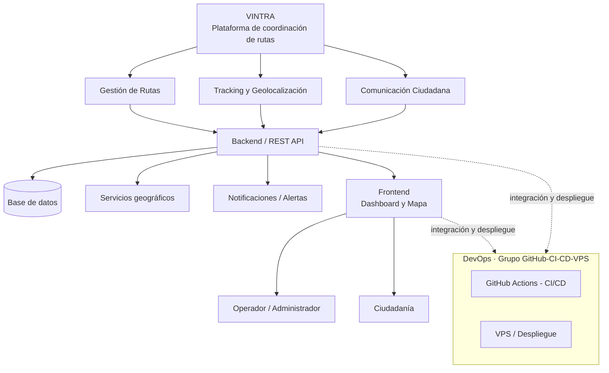

<!-- markdownlint-disable MD033 MD041 -->

<div align="center">

  

  <p><strong>Coordinación de rutas e información clara para la recolección de residuos.</strong></p>
  <p>Proyecto piloto para Buenaventura, Colombia</p>

  <p>
    
    
    
    
  </p>

  <p>
    <a href="docs/arquitectura/README.md">Arquitectura</a> ·
    <a href="backend/README.md">Backend y Swagger</a> ·
    <a href="docs/API_SPECIFICATION.md">API</a> ·
    <a href="CONTRIBUTING.md">Cómo contribuir</a>
  </p>

</div>

<!-- markdownlint-enable MD033 MD041 -->

---

## ¿Qué es VINTRA?

VINTRA es una plataforma digital para la gestión, coordinación y seguimiento de rutas de recolección de residuos sólidos, que conecta la operación del servicio de aseo con la ciudadanía mediante información clara y oportuna sobre horarios, recorridos y novedades del servicio.

## Génesis del proyecto

VINTRA nace de un análisis realizado en clase sobre la problemática de la recolección de residuos sólidos en Buenaventura. Mediante un diagrama de Ishikawa, el equipo identificó y priorizó las causas del problema, encontrando que las de mayor peso eran:

- Deficiencia en la planificación y coordinación de rutas (causa con mayor puntuación).
- Falta de información en tiempo real sobre el paso del vehículo recolector.
A partir de este diagnóstico, se concluyó que el problema no es únicamente la acumulación de basuras —que es una consecuencia—, sino la falta de organización, coordinación y comunicación entre el operador del servicio de aseo y la ciudadanía. VINTRA es la respuesta tecnológica a ese diagnóstico.

## Problema que resuelve

Deficiencias en la planificación, coordinación y comunicación del servicio de recolección de residuos sólidos en Buenaventura, que generan incertidumbre en la ciudadanía sobre el paso del vehículo recolector y favorecen la acumulación de residuos en las calles.

## Propuesta de valor

VINTRA convierte un servicio operado de forma dispersa y poco visible en un sistema coordinado, trazable y comunicado:

| Para el operador | Para la ciudadanía |
| --- | --- |
| Planificación y asignación de rutas | Consulta de horarios y recorridos |
| Seguimiento en tiempo real de vehículos | Aviso de proximidad del vehículo |
| Registro de novedades e incumplimientos | Reporte de acumulación de residuos |
| Indicadores de cumplimiento del servicio | Visibilidad del estado de sus reportes |

## Objetivos

### Objetivo general

Desarrollar una plataforma web que permita gestionar, planificar y monitorear las rutas de recolección de residuos sólidos, proporcionando información operativa y geográfica que facilite la coordinación del servicio y permita a la ciudadanía reportar situaciones relacionadas con la acumulación de residuos.

### Objetivos específicos

- Centralizar la planificación y asignación de rutas y horarios de recolección.
- Ofrecer seguimiento geográfico en tiempo real de los vehículos recolectores.
- Reducir la incertidumbre ciudadana sobre el paso del servicio.
- Permitir el registro y gestión de reportes ciudadanos.
- Generar indicadores de cumplimiento para la toma de decisiones.

## Arquitectura resumida


```mermaid
flowchart TD
    A[VINTRA<br/>Plataforma de coordinación de rutas] --> B[Gestión de Rutas]
    A --> C[Tracking y Geolocalización]
    A --> D[Comunicación Ciudadana]
    B --> E[Backend / REST API]
    C --> E
    D --> E
    E --> F[(Base de datos)]
    E --> G[Servicios geográficos]
    E --> H[Notificaciones / Alertas]
    E --> I[Frontend<br/>Dashboard y Mapa]
    I --> J[Operador / Administrador]
    I --> K[Ciudadanía]
    subgraph DEVOPS["DevOps · Grupo GitHub-CI-CD-VPS"]
        L[GitHub Actions - CI/CD]
        M[VPS / Despliegue]
    end
    E -.integración y despliegue.-> DEVOPS
    I -.integración y despliegue.-> DEVOPS
```

El detalle técnico de la arquitectura, el stack y los contratos entre componentes se documenta en [`docs/arquitectura/README.md`](docs/arquitectura/README.md).

## Tecnologías

El stack utiliza React + Vite, Node.js + NestJS y PostgreSQL/PostGIS con TypeORM y el driver `pg`. PostGIS y el esquema del PR #115 son una referencia provisional; las migraciones no se ejecutan automáticamente. El frontend usa Axios para consultar los endpoints de salud.

| Componente | Tecnología | Responsable |
| --- | --- | --- |
| Frontend | React + Vite | Célula Backend / Frontend |
| Backend | Node.js + NestJS | Célula Backend / Frontend |
| Base de datos | PostgreSQL + TypeORM (`pg`) | Célula Base de Datos |
| Infraestructura y despliegue | *Por definir* | Célula GitHub / CI-CD / VPS |

## Ejecutar la prueba de conexión

Requisitos: Docker Compose. Para ejecutar el backend localmente, Node.js 24 o superior y npm; el frontend local requiere Node.js 22 o superior.

### Ejecutar todo con Docker Compose

Primero copia el ejemplo de configuración y genera valores locales aleatorios para la contraseña de PostgreSQL y el secreto JWT:

```powershell
if (-not (Test-Path .env)) { Copy-Item .env.example .env }
node -e "console.log(require('node:crypto').randomBytes(48).toString('base64url'))"
```

Usa dos valores generados independientes y configúralos como `POSTGRES_PASSWORD` y `JWT_SECRET` en `.env`. No compartas ni confirmes ese archivo. Después:

```powershell
docker compose up --build
```

Abre `http://localhost:5174`. La tarjeta **Estado del entorno** comprueba
`http://localhost:3002/health` y `http://localhost:3002/health/db`. Swagger UI está en
`http://localhost:3002/api/docs`; su esquema JSON, en
`http://localhost:3002/api/docs-json`. Para detener los servicios sin borrar el volumen, usa `docker compose stop`.

Compose publica los servicios solo en `127.0.0.1`: frontend `5174`, backend `3002` y PostgreSQL/PostGIS `5433`. No se ejecutan migraciones ni se crean tablas. La respuesta exitosa de `/health/db` acredita conectividad, no instalación del esquema.

### Ejecutar frontend y API en modo desarrollo

En la raíz, copia `.env.example` a `.env`, completa los secretos locales y arranca PostgreSQL:

```powershell
if (-not (Test-Path .env)) { Copy-Item .env.example .env }
docker compose up -d postgres
```

En dos terminales, inicia API y frontend:

```powershell
cd backend
npm ci
npm run start:dev
```

```powershell
cd frontend
npm ci
npm run dev
```

Abre `http://localhost:5173`. Para detener el servicio, detén el proceso de Compose sin eliminar el volumen. El backend local puede consultar PostgreSQL en `localhost:5433`.

## Equipo

| Célula | Responsabilidad |
| --- | --- |
| UI/UX | Diseño de la Landing Page |
| Base de Datos | Diseño de la base de datos |
| Backend / Frontend | Stack tecnológico, herramientas y configuración del entorno (PostgreSQL) |
| Scrum | Historias de usuario |
| GitHub / CI-CD / VPS | Repositorio, integración continua, despliegue y VPS |

## Estructura del repositorio

Estructura actual del repositorio:

```text
.
├── .github/          # Plantillas de Issues/PR y workflows de CI/CD
├── docs/                         # Documentación organizada por área
│   ├── arquitectura/
│   ├── backend/
│   ├── base-de-datos/
│   ├── frontend/
│   ├── infraestructura/
│   ├── modelado/
│   ├── scrum/
│   ├── ui-ux/
│   └── README.md
├── backend/                      # API REST con NestJS
├── frontend/                     # Aplicación React + Vite
├── infrastructure/               # Documentación y apoyo de despliegue
├── docker-compose.yml            # Ejecución conjunta de los servicios
├── CONTRIBUTING.md
└── README.md
```

Las migraciones y scripts de base de datos están en el PR #115 abierto y no se integran en esta rama mientras sigan pendientes de revisión.

## Flujo de trabajo

- **Estrategia de ramas:** `main` → `develop` → `feat/` · `fix/` · `docs/`
- **Workflows de CI:** `ci.yml` valida whitespace, Markdown y enlaces, y ejecuta los workflows reutilizables de backend y frontend.
- **Plantillas de Issues y Pull Requests:** ver mas en  [`CONTRIBUTING.md`](CONTRIBUTING.md)
- **Despliegue:** VPS *(configuración pendiente)*
Responsable: grupo GitHub-CI-CD-VPS, encargado de que el repositorio funcione como columna vertebral que integra a los demás equipos, no solo como un lugar donde guardar código.

## Estado del proyecto

VINTRA se encuentra en fase de definición. La propuesta general, el problema, los objetivos y la arquitectura resumida ya están establecidos. Falta que cada célula complete la información de su área:

- [ ] **UI/UX** — Diseño de la landing page.
- [ ] **Base de Datos** — Revisar y aprobar PR #115; resolver diferencias entre diccionario y DDL antes de habilitar integración funcional.
- [x] **Backend / Frontend** — API modular provisional, autenticación JWT/Argon2id, endpoints de los módulos registrados, documentación Swagger y prueba base de conexión implementados.
- [ ] **Scrum** — Historias de usuario.
- [ ] **GitHub / CI-CD / VPS** — Plantillas de Issues/PR, workflows de CI/CD, estrategia de ramas ya definida, configuración y despliegue en el VPS.
Este README se irá actualizando a medida que cada célula entregue su información.

## Cómo contribuir

*(Guía de flujo de trabajo para el equipo del proyecto. Aplica para todas las célu­las, disponible en[`CONTRIBUTING.md`](CONTRIBUTING.md).)*

## Licencia

*Apache 2.0 — Universidad del Valle, Sede Buenaventura.*

 <!-- markdownlint-disable MD033 -->
---

<div align="center">
**VINTRA** — Coordinación de rutas, información para la ciudadanía.

</div>
<!-- markdownlint-enable MD033 -->
