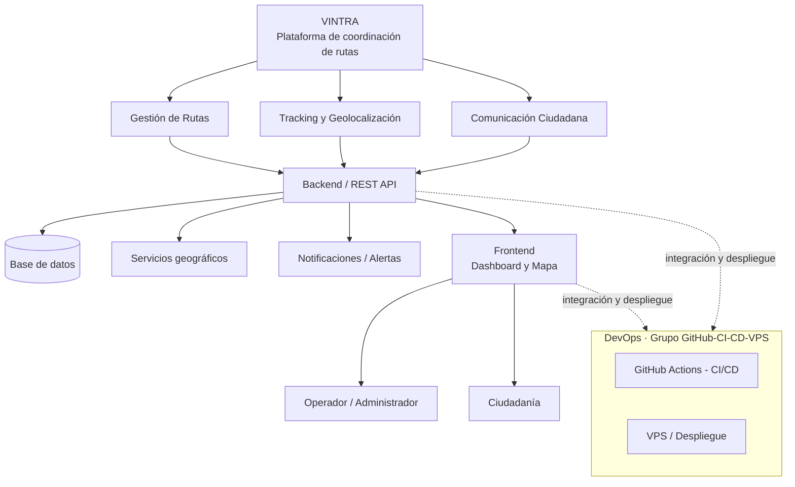
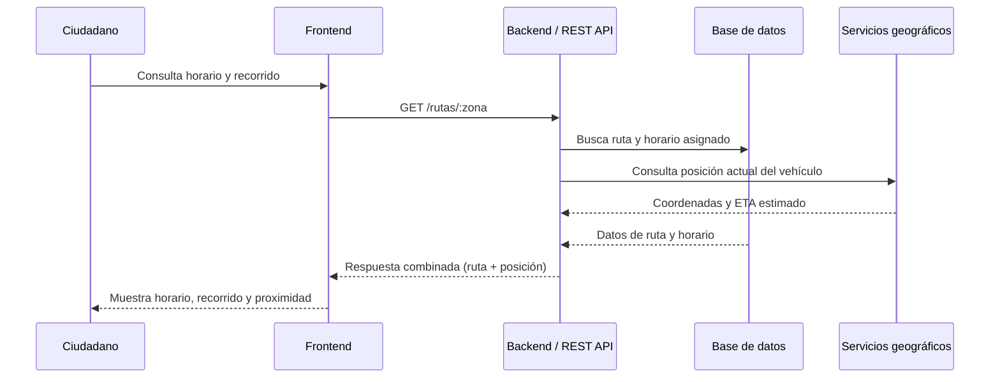

# Arquitectura de VINTRA

Este documento es la referencia técnica del proyecto: describe los componentes del sistema, cómo se relacionan entre sí y qué decisiones de arquitectura ya están tomadas frente a las que siguen pendientes. Complementa la visión general disponible en el [README](../README.md).

## Tabla de contenido

- [Resumen](#resumen)
- [Diagrama de arquitectura](#diagrama-de-arquitectura)
- [Componentes](#componentes)
- [Flujo de una solicitud típica](#flujo-de-una-solicitud-típica)
- [Modelo de datos](#modelo-de-datos)
- [Contratos de API](#contratos-de-api)
- [Geolocalización y notificaciones](#geolocalización-y-notificaciones)
- [Seguridad](#seguridad)
- [Infraestructura y despliegue](#infraestructura-y-despliegue)
- [Decisiones pendientes](#decisiones-pendientes)

## Resumen

VINTRA es una plataforma web compuesta por un backend con API REST, una base de datos, servicios de geolocalización y notificaciones, y un frontend con dos vistas: un dashboard para el operador/administrador y una vista de consulta para la ciudadanía. El diagnóstico que originó el proyecto (falta de planificación, coordinación y comunicación en la recolección de residuos) define el alcance funcional: gestión de rutas, tracking en tiempo real y comunicación ciudadana.

## Diagrama de arquitectura

## Componentes

| Componente | Responsabilidad | Estado |
| --- | --- | --- |
| Backend / REST API | Expone los endpoints que usan el frontend y, eventualmente, integraciones externas. Centraliza las reglas de negocio de rutas, tracking y reportes ciudadanos. | Stack pendiente — célula Backend / Frontend |
| Base de datos | Fuente de verdad: rutas, horarios, vehículos, reportes ciudadanos, indicadores. | Motor definido: PostgreSQL — modelo pendiente, célula Base de Datos |
| Servicios geográficos | Geolocalización de vehículos y cálculo/consulta de recorridos. | Pendiente de definición |
| Notificaciones / Alertas | Avisa a la ciudadanía sobre proximidad del vehículo recolector y novedades del servicio. | Pendiente de definición |
| Frontend — Dashboard | Vista para el operador/administrador: planificación de rutas, seguimiento en tiempo real, gestión de novedades e indicadores. | Pendiente de definición, célula Backend / Frontend |
| Frontend — Consulta ciudadana | Vista para la ciudadanía: horarios, recorridos, aviso de proximidad y reporte de acumulación de residuos. | Pendiente de definición, célula UI/UX y Backend / Frontend |
| DevOps (GitHub Actions / VPS) | Integración continua, despliegue y configuración del VPS. | En definición, célula GitHub / CI-CD / VPS |

## Flujo de una solicitud típica

*Este diagrama es ilustrativo del flujo funcional descrito en el README; los endpoints y contratos reales se definirán junto con el stack.*

## Modelo de datos

*Pendiente — célula Base de Datos.*

Entidades que ya se sabe que el sistema necesita representar, a partir del alcance funcional definido:

- Rutas y horarios de recolección
- Vehículos recolectores
- Zonas / sectores de cobertura
- Novedades e incumplimientos del servicio
- Reportes ciudadanos (acumulación de residuos)
- Indicadores de cumplimiento

El modelo entidad-relación, las migraciones y el motor específico de PostgreSQL a usar se documentarán aquí cuando la célula de Base de Datos los defina.

## Contratos de API

*Pendiente — célula Backend / Frontend.*

Aquí se documentarán los endpoints (rutas, métodos, request/response) que consume el frontend, una vez el stack de backend esté definido. Sugerido: una tabla por recurso (rutas, vehículos, reportes, indicadores) con método, path, parámetros y respuesta esperada.

## Geolocalización y notificaciones

*Pendiente de definición.*

Queda por decidir:

- Proveedor de mapas/geolocalización (por ejemplo Google Maps, OpenStreetMap, u otro).
- Mecanismo de tracking en tiempo real (polling, WebSockets, u otro).
- Canal de notificaciones a la ciudadanía (push, SMS, correo, u otro).

## Seguridad

*Pendiente de definición.*

Puntos a resolver junto con el stack de backend:

- Autenticación y autorización para el rol Operador/Administrador.
- Nivel de acceso público (sin autenticación) para la consulta ciudadana.
- Manejo de datos sensibles de ubicación de vehículos y reportes ciudadanos.

## Infraestructura y despliegue

Responsabilidad de la célula GitHub / CI-CD / VPS:

- Estructura del repositorio (`.github/`, `docs/`, `backend/`, `frontend/`, `database/`, `infrastructure/`).
- Workflows de CI/CD: `ci.yml` valida cambios en PR hacia `develop` y pushes a `develop`/`main`; `backend.yml` y `frontend.yml` están pendientes de implementación.
- Estrategia de ramas: `main` → `develop` → `feature/` · `fix/` · `task/`.
- Configuración y despliegue en el VPS — pendiente.

## Decisiones pendientes

| Decisión | Responsable | Estado |
| --- | --- | --- |
| Lenguaje y framework de backend | Célula Backend / Frontend | Pendiente |
| Framework de frontend | Célula Backend / Frontend | Pendiente |
| Modelo de datos en PostgreSQL | Célula Base de Datos | Pendiente |
| Diseño de la landing page | Célula UI/UX | Pendiente |
| Historias de usuario | Célula Scrum | Pendiente |
| Proveedor de geolocalización | Backend / Frontend | Pendiente |
| Mecanismo de notificaciones | Backend / Frontend | Pendiente |
| Workflows de CI/CD y despliegue en VPS | Célula GitHub / CI-CD / VPS | En definición |

Este documento se irá actualizando a medida que cada célula entregue sus decisiones.
