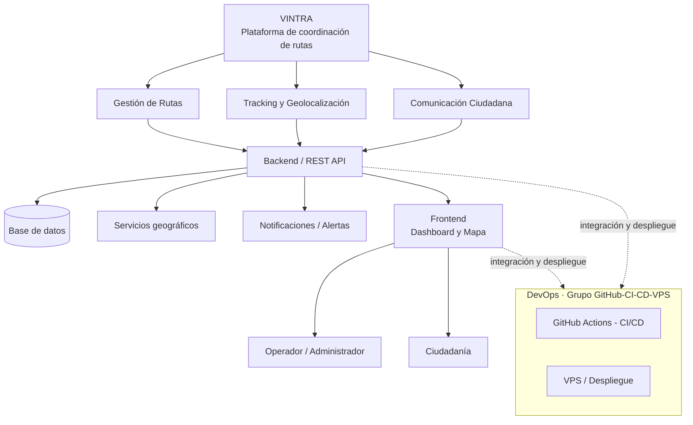
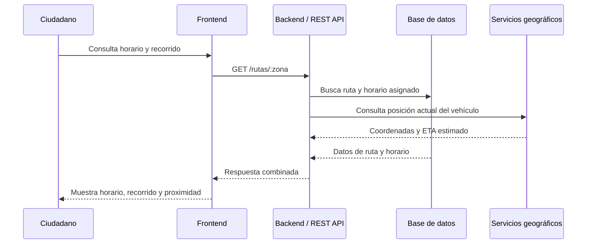

# Arquitectura de VINTRA

Este documento es la referencia técnica para los componentes del sistema, sus relaciones y las decisiones que afectan a más de un área. Complementa la visión general del [`README` raíz](../../README.md).

## Estado

- Estado: `En revisión`
- Responsable: GitHub / CI-CD / VPS, con aportes de las células involucradas
- Fuente anterior: `docs/ARCHITECTURE.md`

## Resumen

VINTRA es una plataforma web compuesta por un backend con API REST, una base de datos, servicios de geolocalización y notificaciones, y un frontend con dos vistas: un dashboard para el operador/administrador y una vista de consulta para la ciudadanía. El diagnóstico que originó el proyecto —falta de planificación, coordinación y comunicación en la recolección de residuos— define el alcance funcional: gestión de rutas, tracking en tiempo real y comunicación ciudadana.

## Diagrama de arquitectura

## Componentes

| Componente | Responsabilidad | Estado |
| --- | --- | --- |
| Backend / REST API | Expone los endpoints y centraliza las reglas de negocio de rutas, tracking y reportes ciudadanos. | Stack pendiente |
| Base de datos | Fuente de verdad para rutas, horarios, vehículos, reportes e indicadores. | PostgreSQL definido; modelo pendiente |
| Servicios geográficos | Geolocalización de vehículos y consulta de recorridos. | Pendiente |
| Notificaciones / Alertas | Avisos sobre proximidad del vehículo y novedades del servicio. | Pendiente |
| Frontend | Dashboard operativo y consulta ciudadana. | Pendiente |
| DevOps | Integración continua, despliegue y configuración del VPS. | En definición |

## Flujo de una solicitud típica

El endpoint del diagrama es ilustrativo. Los contratos reales se documentarán en [`../backend/README.md`](../backend/README.md).

## Decisiones pendientes

| Decisión | Responsable | Estado |
| --- | --- | --- |
| Lenguaje y framework de backend | Backend / Frontend | Pendiente |
| Framework de frontend | Backend / Frontend | Pendiente |
| Modelo de datos en PostgreSQL | Base de Datos | Pendiente |
| Diseño de la landing page | UI/UX | Pendiente |
| Historias de usuario | Scrum | Pendiente |
| Proveedor de geolocalización | Backend / Frontend | Pendiente |
| Mecanismo de notificaciones | Backend / Frontend | Pendiente |
| Workflows de CI/CD y despliegue en VPS | GitHub / CI-CD / VPS | En definición |

Los contratos, el modelo de datos, los requisitos y las instrucciones operativas se mantienen en sus carpetas respectivas y deben enlazarse aquí cuando una decisión cambie la arquitectura.
