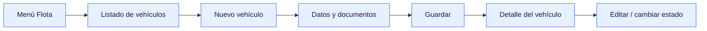
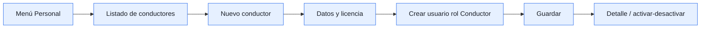
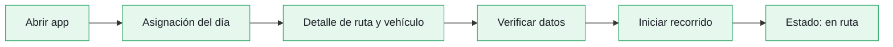

# UI/UX

Guía para documentar la experiencia de quienes consultan o administran el servicio.

## Debe publicarse aquí

- objetivos y necesidades de cada perfil;
- flujos de navegación y prototipos;
- decisiones de diseño visual y componentes reutilizables;
- estados vacíos, carga, error y confirmación;
- criterios de accesibilidad y diseño responsive;
- recursos entregados al frontend y su versión vigente.

## Estado

- Estado: `Borrador`
- Responsable: Célula UI/UX
- Pendiente: publicar la landing page, flujos y criterios visuales.

---

## 1. Objetivo

Definir la estructura de navegación, las pantallas, los flujos y los criterios de experiencia de usuario necesarios para que VINTRA permita gestionar la flota, el personal, las rutas y la operación del servicio de recolección de residuos.

El diseño contempla los diferentes perfiles de usuario y sus responsabilidades dentro de la plataforma:

- Administrador
- Conductor
- Ciudadano

---

## 2. Perfiles y roles

### 2.1 Administrador

Responsable de gestionar y supervisar la operación de la plataforma.

#### Permisos del administrador

- Gestionar vehículos.
- Gestionar conductores.
- Crear y modificar macrorutas.
- Crear y modificar microrutas.
- Asignar vehículos.
- Asignar conductores.
- Consultar recorridos.
- Consultar incidencias.
- Supervisar el estado de las rutas.
- Consultar la ubicación GPS de los vehículos.

---

### 2.2 Conductor

Responsable de ejecutar el recorrido que le fue asignado.

#### Permisos del conductor

- Consultar recorrido asignado.
- Iniciar recorrido.
- Enviar o registrar ubicación GPS.
- Consultar información de la ruta.
- Registrar incidencias durante el recorrido.
- Marcar novedades de recolección.
- Finalizar recorrido.

---

### 2.3 Ciudadano

Responsable de consultar información relacionada con el servicio y reportar problemas.

#### Permisos del ciudadano

- Consultar horarios.
- Consultar rutas.
- Consultar el estado de recolección.
- Reportar residuos no recogidos.
- Consultar el estado de sus reportes.

---

## 3. Pantallas identificadas

### 3.1 Gestión de flota

---

#### 3.1.1 Listado principal / Dashboard de flota

- Listado de vehículos registrados.
- Placa.
- Marca y modelo.
- Capacidad de carga.
- Tipo de combustible.
- Conductor asignado.
- Estado del vehículo.
- Búsqueda y filtros por estado.

---

#### 3.1.2 Registro / edición de vehículo

- Placa.
- Marca y modelo.
- Año.
- Capacidad de carga.
- Tipo de combustible.
- Fecha de última revisión técnica.

---

#### 3.1.3 Hoja de vida / detalle del vehículo

- Información técnica del vehículo.
- Estado actual.
- Conductor asignado.
- Historial de rutas recorridas.
- Historial de mantenimientos.
- Historial de fallas.

---

#### 3.1.4 Registro de mantenimiento / novedad

- Tipo de novedad.
- Avería mecánica.
- Mantenimiento programado.
- Accidente.
- Fecha estimada de retorno.
- Observaciones.

---

### 3.2 Gestión del personal

#### 3.2.1 Listado de conductores

- Buscador y filtros por estado y disponibilidad.
- Nombre.
- Documento.
- Teléfono.
- Estado (activo/inactivo).
- Vencimiento de licencia.
- Nuevo conductor.
- Ver conductor.
- Editar conductor.
- Desactivar conductor.

---

#### 3.2.2 Detalle / perfil del conductor

- Foto.
- Datos personales.
- Datos de contacto.
- Licencia.
- Categoría de licencia.
- Fecha de vencimiento de licencia.
- Estado actual.
- Vehículo asignado.
- Ruta asignada.
- Historial de recorridos.
- Editar conductor.

---

#### 3.2.3 Crear / editar conductor

- Nombre.
- Documento.
- Teléfono.
- Correo.
- Foto.
- Número de licencia.
- Categoría de licencia.
- Fecha de vencimiento.
- Usuario.
- Contraseña.
- Rol Conductor.
- Guardar.
- Cancelar.
- Validación de campos obligatorios.

---

#### 3.2.4 Activar / desactivar conductor

- Nombre del conductor.
- Confirmación de activación o desactivación.
- Motivo de la desactivación.
- Aviso de asignación activa o pendiente.

---

#### 3.2.5 Disponibilidad y turnos

- Calendario o tabla semanal.
- Turnos asignados.
- Disponible.
- En ruta.
- Descanso.
- Incapacidad.
- Asignar turno.
- Editar turno.
- Conflictos de horarios.

---

#### 3.2.6 Gestión de usuarios y roles

- Lista de usuarios.
- Administrador.
- Conductor.
- Ciudadano.
- Estado del usuario.
- Crear usuario.
- Editar usuario.
- Bloquear usuario.
- Restablecer contraseña.
- Asignación de roles.
- Permisos asociados a cada rol.

---

---

### 3.3 Gestión de rutas

#### 3.3.1 Listado de rutas

- Visualizar macrorutas y microrutas.
- Consultar el estado de cada ruta.
- Consultar vehículo y conductor asignados.

---

#### 3.3.2 Crear macroruta

- Definir zona o sector de cobertura.
- Establecer recorrido general.
- Registrar información de la macroruta.

---

#### 3.3.3 Crear microruta

- Asociar la microruta a una macroruta.
- Definir sectores o puntos de recorrido.
- Establecer recorrido específico.

---

#### 3.3.4 Detalle de ruta

- Visualizar información de la ruta.
- Consultar recorrido.
- Consultar horario.
- Consultar estado.
- Visualizar vehículo y conductor asignados.

---

#### 3.3.5 Editar / modificar ruta

- Modificar información de la ruta.
- Actualizar recorrido.
- Modificar sectores o puntos de cobertura.
- Actualizar horario.

---

#### 3.3.6 Asignación de vehículo y conductor

- Seleccionar vehículo disponible.
- Seleccionar conductor disponible.
- Asociarlos a una ruta.
- Confirmar o modificar la asignación.

---

#### 3.3.7 Estado de la ruta

- Pendiente.
- Asignada.
- En recorrido.
- Finalizada.

---

### 3.4 Gestión de operación

#### 3.4.1 Dashboard de operación

- Indicadores: vehículos en ruta, disponibles, en taller y conductores activos.
- Recorridos del día (programados, en curso, finalizados).
- Alertas de novedades y accesos rápidos a asignación y monitoreo.

---

#### 3.4.2 Asignación de vehículo y conductor

- Selector de ruta, fecha y horario.
- Lista de vehículos y conductores disponibles.
- Validación de conflictos (licencia vencida, ya asignado) y botón Confirmar.

---

#### 3.4.3 Monitoreo en vivo (mapa)

- Mapa con la ubicación de los vehículos en tiempo real.
- Panel lateral con la lista de recorridos activos y su estado.
- Al tocar un vehículo: conductor, ruta y hora estimada de llegada.

---

#### 3.4.4 Historial de recorridos y novedades

- Filtros por fecha, ruta, vehículo y conductor.
- Tabla con hora de inicio y fin, estado y novedades registradas.
- Detalle de cada recorrido y opción de exportar.

---

#### 3.4.5 Asignación del día

- Ruta, vehículo y horario asignados.
- Resumen de paradas y datos del vehículo.
- Botón "Iniciar recorrido".

---

#### 3.4.6 Recorrido en curso

- Mapa con la ruta y la siguiente parada.
- Cronómetro o hora estimada de llegada.
- Botones: registrar novedad (texto, foto) y finalizar recorrido.

---

#### 3.4.7 Historial de recorridos del conductor

- Lista de recorridos anteriores con fecha, ruta y estado.
- Detalle con las novedades que registró.

---

#### 3.4.8 Mapa de vehículos en vivo

- Mapa con los vehículos en movimiento.
- Filtro por ruta y toque en un vehículo para ver su ruta y hora estimada.
- Paradas cercanas.

---

#### 3.4.9 Consulta de rutas y horarios

- Listado de rutas con buscador.
- Detalle: recorrido, paradas y horarios.
- Opción de marcar rutas favoritas.

---

#### 3.4.10 Notificaciones

- Lista cronológica de avisos (retrasos, cambios de ruta, novedades).
- Marcar como leído y configurar qué avisos recibir.

---

#### 3.4.11 Reportes de incidencia o problemas

- Formulario con tipo de problema, ruta o parada, descripción y foto opcional.
- Botón Enviar y confirmación con un número de seguimiento.
- Lista de reportes enviados y su estado (recibido, en revisión, resuelto).

---

### 3.5 Flujos

#### 3.5.1 Flujo de registro y gestión de vehículos

#### 3.5.2 Flujo de registro y gestión de conductores

#### 3.5.3 Flujo de creación y modificación de rutas

#### 3.5.4 Flujo de asignación de vehículo y conductor

#### 3.5.5 Flujo de inicio de recorrido

#### 3.5.6 Flujo de finalización de recorrido

#### 3.5.7 Flujo de navegación entre las pantallas administrativas

---

## 4. Listado priorizado de pantallas

| # | Área | Pantalla | Rol | Prioridad | Flujo relacionado |
|---|------|----------|-----|-----------|--------------------|
| 1 | Compartida | Login | Todos | Alta | Acceso |
| 2 | Compartida | Registro | Ciudadano | Alta | Acceso |
| 3 | Compartida | Recuperar contraseña | Todos | Media | Acceso |
| 4 | Compartida | Mi perfil | Conductor, Ciudadano | Baja | Cuenta |
| 5 | Flota | Listado de vehículos | Administrador | Alta | 3.6.1 |
| 6 | Flota | Registro / edición de vehículo | Administrador | Alta | 3.6.1 |
| 7 | Flota | Hoja de vida / detalle del vehículo | Administrador | Media | 3.6.1 |
| 8 | Flota | Registro de mantenimiento / novedad | Administrador | Media | 3.6.1 |
| 9 | Personal | Listado de conductores | Administrador | Alta | 3.6.2 |
| 10 | Personal | Crear / editar conductor | Administrador | Alta | 3.6.2 |
| 11 | Personal | Detalle / perfil del conductor | Administrador | Media | 3.6.2 |
| 12 | Personal | Activar / desactivar conductor | Administrador | Media | 3.6.2 |
| 13 | Personal | Disponibilidad y turnos | Administrador | Media | 3.6.2 |
| 14 | Personal | Gestión de usuarios y roles | Administrador | Media | — |
| 15 | Rutas | Listado de rutas | Administrador | Alta | 3.6.3 |
| 16 | Rutas | Crear macroruta | Administrador | Alta | 3.6.3 |
| 17 | Rutas | Crear microruta | Administrador | Alta | 3.6.3 |
| 18 | Rutas | Detalle de ruta | Administrador | Media | 3.6.3 |
| 19 | Rutas | Editar / modificar ruta | Administrador | Media | 3.6.3 |
| 20 | Rutas | Asignación de vehículo y conductor (desde ruta) | Administrador | Alta | 3.6.4 |
| 21 | Operación | Dashboard de operación | Administrador | Alta | 3.6.7 |
| 22 | Operación | Asignación de vehículo y conductor | Administrador | Alta | 3.6.4 |
| 23 | Operación | Monitoreo en vivo (mapa) | Administrador | Alta | 3.6.5 / 3.6.6 |
| 24 | Operación | Historial de recorridos y novedades | Administrador | Media | 3.6.6 |
| 25 | Operación | Asignación del día | Conductor | Alta | 3.6.5 |
| 26 | Operación | Recorrido en curso | Conductor | Alta | 3.6.5 / 3.6.6 |
| 27 | Operación | Historial de recorridos | Conductor | Media | 3.6.6 |
| 28 | Operación | Mapa de vehículos en vivo | Ciudadano | Alta | — |
| 29 | Operación | Consulta de rutas y horarios | Ciudadano | Alta | — |
| 30 | Operación | Notificaciones | Ciudadano | Media | — |
| 31 | Operación | Reportes de incidencia o problemas | Ciudadano | Baja | — |

### Resumen

**Por prioridad**

| Prioridad | Pantallas |
|---|---|
| Alta | 17 |
| Media | 12 |
| Baja | 2 |

**Por rol** (una pantalla puede aparecer en más de un rol)

| Rol | Pantallas |
|---|---|
| Administrador | 20 |
| Ciudadano | 6 |
| Conductor | 4 |
| Todos los roles | 2 |

---
